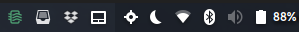

# Spare The Air status

Living in the Bay Area California and being a bigtime BBQ-er means that you have to pay attention to the "Spare The Air" days.  I got sick of browsing their less than stellar website and decided to make an indicator for my laptop.

Check the status of the Spare The Air alerts from your Appindicator (Linux)

color code:

- green: no alert
- red: alert in effect
- orange: unable to contact service

## Credit

The original Pokemon Go Status app for Linux made by [Sousatg](https://github.com/sousatg/pokemon-go-status/)

The original Pokemon Go Status app for MacOS made by [Lacsap-](https://github.com/Lacsap-/pokemon-go-status)
